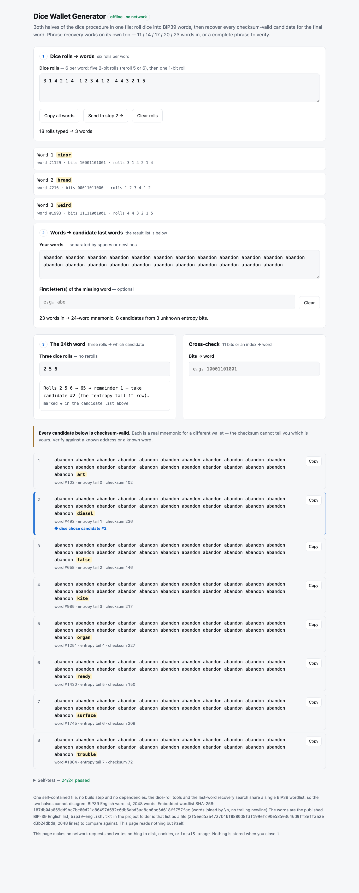

# Dice Wallet Generator

[](https://github.com/michaeldykim/dice-wallet-generator/actions/workflows/verify.yml)

One file, `dice-wallet-generator.html`, that does both halves of building a
BIP39 wallet from dice, offline. Open it in any browser — there is no build
step, no dependencies, and no network. `node verify.mjs` runs the test suite.

<picture>
  <source media="(prefers-color-scheme: dark)" srcset="docs/screenshot-dark.png">
  
</picture>

The screenshot is the README's own worked examples — `3 1 4 2 1 4` giving
`minor`, and `2 5 6` choosing candidate #2 — with the standard BIP39 test-vector
words in step 2, so nothing in it is anybody's seed.

## Before you use this

Plainly, so that none of it has to be inferred:

- **It is not audited.** It is a wallet generator written by one person. The
  mitigation is that it is small and meant to be read: one hand-editable HTML
  file, one `<script>`, no dependencies and no build step, all of it visible in
  view-source. Read it, or have someone you trust read it, before trusting it
  with money.
- **Verify the copy you have** against the hash below. SHA-256 is the only
  thing standing between you and a copy that was modified in transit.
- **The checksum catches typos, not wrong lookups.** A mistake in Part 1 that
  lands on a different valid word produces a different — equally valid —
  wallet, and no tool can detect it. See *Cautions*.
- **Keep the whole session offline**, including the dice rolls themselves.
  Never type or photograph rolls on a networked machine.

The page makes the first three of these checkable rather than merely promised:
it declares `default-src 'none'`, writes nothing to storage, and recomputes its
own wordlist hash on load into the self-test at the bottom of the page.

## Verify what you downloaded

```sh
shasum -a 256 dice-wallet-generator.html

# eda90bca8a64d5b90f4de44294ac66f2a233c7aa12986a1f01ed1471a3a44136
```

That is the hash of the current release. If it does not match, stop — do not
open the file. The same command on both machines confirms the copy reached the
airgapped one intact:

```sh
shasum -a 256 dice-wallet-generator.html   # run on both ends, compare by eye
```

The hash changes with every edit to the page, so it is worth re-checking after
any update. The page's own self-test reports a *different* number — that one
covers the wordlist alone, not the file; see *Verifying the wordlist*.

## What it does

It does two jobs, sharing one wordlist and nothing else:

- **Dice rolls → words** (steps 1 and 3). Type six rolls per word and read the
  BIP39 word, its index, and the eleven bits behind it; three final rolls choose
  one of the eight candidates for the 24th word.
- **Last-word recovery** (step 2). Given a mnemonic missing its last word — 11 or
  23 words given, also 14/17/20 — list every checksum-valid candidate for it
  rather than guessing at one.

## Generating a 24-word seed from dice

The dice do two separate jobs. Rolls produce all 253 bits behind the first
23 words (23 × 11). Then, after step 2 narrows the 24th word to 8 candidates,
three final rolls choose one of them — supplying the last 3 entropy bits. The
finished mnemonic therefore carries a full 256 bits of dice entropy.

### Part 1 — Generate the 23 words

**Roll mapping** (done by step 1 of the page; listed here for auditability):

| Roll  | Bits |
|-------|------|
| 1     | 00   |
| 2     | 01   |
| 3     | 10   |
| 4     | 11   |
| 5, 6  | reroll |

**Last roll** (1 bit): 1–3 → 0, 4–6 → 1.

For each word:

1. Roll the die **5 times** (rerolling any 5 or 6 immediately) — each roll
   gives 2 bits → 10 bits.
2. Roll **once more** for the 11th bit (no reroll needed).
3. Type the 6 rolls into **Dice rolls** — it shows the word, its index
   (`word #N`), and the 11 bits. Check the bits against your rolls.
4. Repeat for all 23 words. Expect ~196 rolls total.
5. Press **Send to step 2 →** to carry all 23 words into **Your words** — it
   types them in for you, exactly as you would.

**Worked example, one word:** rolls `3 1 4 2 1 4` →

| roll | bits |
|------|------|
| 3    | 10   |
| 1    | 00   |
| 4    | 11   |
| 2    | 01   |
| 1    | 00   |
| 4    | 1    |

Bits: `1 0 0 0 1 1 0 1 0 0 1` → 1024 + 64 + 32 + 8 + 1 = **1129** → `minor`.

### Part 2 — The 24th word

1. On the airgapped machine, open the page and confirm the self-test at the
   bottom reads all-pass.
2. With the 23 words in **Your words**, the status line reads "23 words in →
   24-word mnemonic. 8 candidates from 3 unknown entropy bits" and the list
   below shows the 8 candidates, numbered 1–8.
3. Roll **3 dice** and type them into **Three dice rolls** (step 3). The page
   computes `(a−1)·36 + (b−1)·6 + (c−1)` — a number from 0 to 215 — takes it
   mod 8, and marks the candidate to take with a **◆** in the list. No rerolls
   are needed: 216 = 8 × 27 exactly, so every candidate is equally likely.
4. Take that candidate. That is the 24th word. Changing the rolls moves the
   mark; clearing them takes it off.

**Worked example:** rolls 2, 5, 6 → 1·36 + 4·6 + 5 = 65 → 65 mod 8 = 1 →
**candidate #2** (the "entropy tail 1" row).

Each candidate row also shows `word #N`, the word's index in the list, which can
double-check a Part 1 lookup. Step 3 names the candidate in words as well — "take
candidate #2 (the 'entropy tail 1' row)" — so the ◆ need not be trusted alone.

### Part 3 — Record and verify

1. Write the full 24 words on paper (and a metal backup if you keep one).
2. Re-type all 24 words into **Your words**. With a complete phrase the page
   reports "Valid — 24-word mnemonic, checksum matches." Do this before funding
   the wallet.

### Using only the recovery half

To recover a wallet whose last word is lost, put the known words into **Your
words** — that is step 2 on its own — and every checksum-valid candidate is
listed. Only an address lookup can tell them apart, and that is out of scope here
on purpose: it must not be done on a networked machine.

The optional **First letter(s) of the missing word** field narrows the list.
BIP39 guarantees four leading letters identify a word uniquely, which the page's
self-test asserts. **Cross-check** (11 bits or an index → word) double-checks a
lookup by hand.

### Cautions

- **The checksum catches typos, not wrong lookups.** A mistake in Part 1 that
  lands on a different valid word produces a different — equally good — wallet,
  and the tool cannot know. Double-check the bits and words shown against your
  recorded rolls, ideally with a second person.
- **The page groups every 6 rolls as one word.** A missed or extra roll shifts
  every word after it — check the rolls shown per word against your paper.
- **Keep the whole session offline.** The page enforces no-network and
  no-persistence by design, but the dice rolls themselves should never be
  typed or photographed on a networked machine.

## Verifying the wordlist

Every word this tool shows comes from one list, and that list is checkable
without trusting the page.

`bip39-english.txt` in this folder is the published BIP-39 English list —
`bip-0039/english.txt` from the [bitcoin/bips](https://github.com/bitcoin/bips)
repository, fetched 2026-09-11 and unmodified: 2048 words, one per line, LF line
endings, a trailing newline, 13116 bytes.

```sh
shasum -a 256 bip39-english.txt
# 2f5eed53a4727b4bf8880d8f3f199efc90e58503646d9ff8eff3a2ed3b24dbda
```

That hash, not the URL, is what actually pins the list — `master` moves, the
digest does not.

The page embeds those same 2048 words joined by `\n` with no trailing newline,
which is why the number in its footer is different:

```
187db04a869dd9bc7be80d21a86497d692c0db6abd3aa8cb6be5d618ff757fae   (words joined, no trailing newline)
2f5eed53a4727b4bf8880d8f3f199efc90e58503646d9ff8eff3a2ed3b24dbda   (the file above, as downloaded)
```

The only difference between them is `words.join("\n")`.

The page recomputes its own hash on load — that is the `wordlist SHA-256` row in
the self-test — and `node verify.mjs` goes further, comparing the words embedded
in the page against `bip39-english.txt` position by position. To do that check by
hand instead: the list is sorted, so `words[i]` is the *i*th word of the file,
which is exactly the index each candidate row prints.

The page never reads this file. It is a reference for you, not an input to the
tool, and the page stays a single file that runs alone — carry both to the
airgapped machine if you want to repeat the check there.

## Running the tests

```sh
node verify.mjs   # exits 1 on failure; no dependencies, no install step
```

It extracts the page's `<script>`, runs it against a stub DOM, and calls the
page's own `selfTest()`, `compute()`, `wordsFromRolls()` and `pickIndex()`. On
top of that it builds phrases with `node:crypto` — which shares no code with the
page — deletes the last word, and asserts recovery, 300 random seeds at both 12
and 24 words, plus 300 runs of the whole dice procedure. If you edit the page,
update the hash at the top of this README in the same commit.

## License

MIT — see [LICENSE](LICENSE). The BIP-39 English wordlist is from
[bitcoin/bips](https://github.com/bitcoin/bips) under its own terms.
